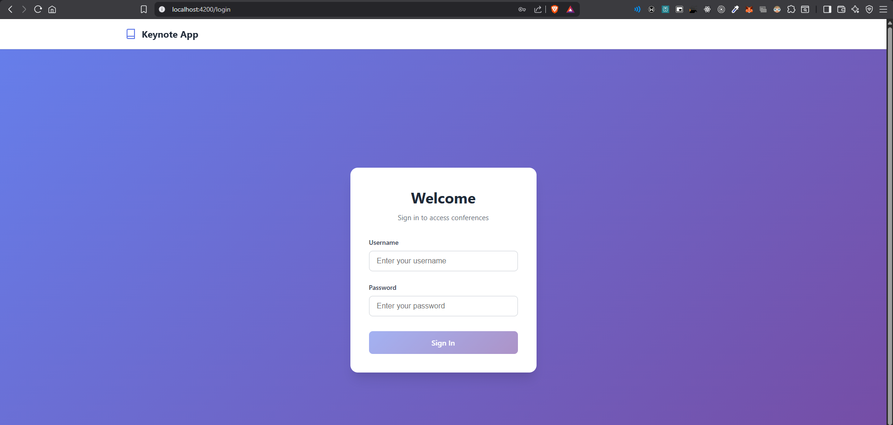
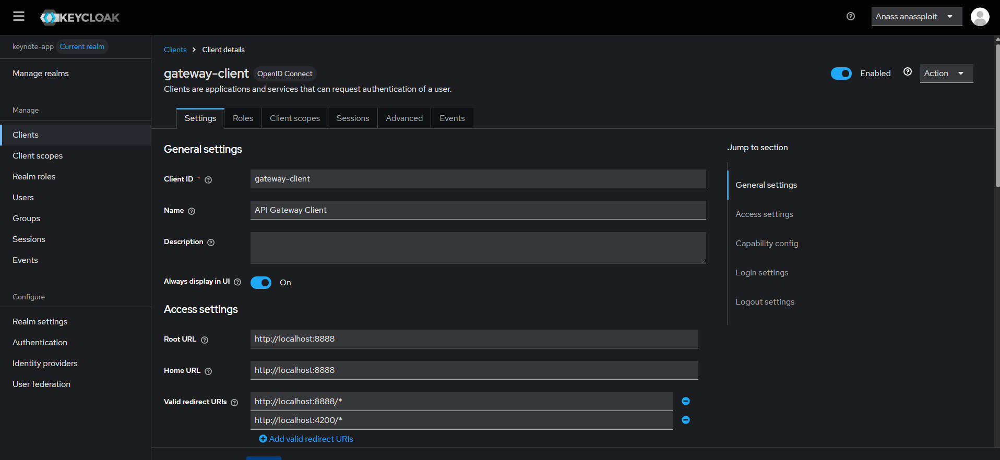
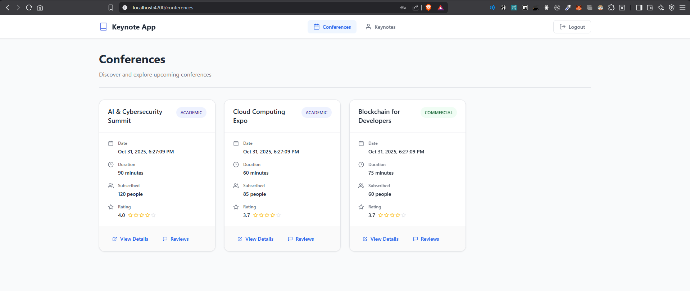
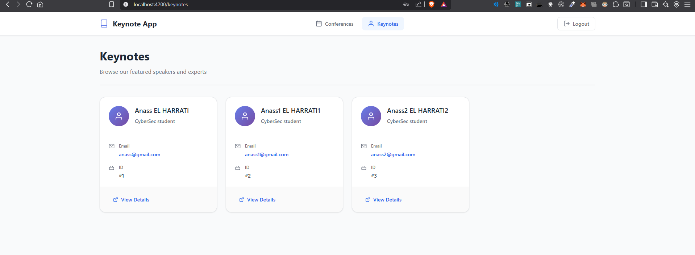

# Keynote Application - Microservices Architecture

A comprehensive microservices-based application for managing conferences and keynotes, featuring Angular frontend, Spring Boot microservices, and Keycloak authentication.

## Table of Contents

- [Project Overview](#project-overview)
- [Architecture](#architecture)
- [Microservices](#microservices)
- [Frontend (Angular)](#frontend-angular)
- [Keycloak Authentication](#keycloak-authentication)
- [File Structure](#file-structure)
- [Screenshots](#screenshots)
- [Getting Started](#getting-started)
- [Prerequisites](#prerequisites)
- [Installation & Setup](#installation--setup)
- [Running the Application](#running-the-application)
- [API Endpoints](#api-endpoints)

## Project Overview

This project is a distributed system for managing conferences and their associated keynotes. It demonstrates a modern microservices architecture with:

- **Service Discovery**: Eureka-based service registry
- **API Gateway**: Spring Cloud Gateway for routing and token relay
- **Configuration Server**: Centralized configuration management
- **Resource Services**: Conference and Keynote management services
- **Frontend**: Angular application with Keycloak integration
- **Security**: Keycloak OAuth2/OIDC authentication and authorization

## Architecture

```
┌─────────────────────────────────────────────────────────┐
│                    Angular Frontend                      │
│                    (Port 4200)                          │
└───────────────────────┬─────────────────────────────────┘
                        │
                        ▼
┌─────────────────────────────────────────────────────────┐
│              Spring Cloud Gateway                        │
│                  (Port 8888)                             │
│         - Token Relay                                    │
│         - Service Discovery Routing                      │
└─────┬───────────────┬───────────────┬───────────────────┘
      │               │               │
      ▼               ▼               ▼
┌──────────┐    ┌─────────────┐   ┌─────────────┐
│ Eureka   │    │ Conference  │   │  Keynote    │
│ Service  │    │  Service    │   │  Service    │
│(8761)    │    │   (8082)     │   │   (8081)    │
└──────────┘    └─────────────┘   └─────────────┘
      │               │               │
      └───────────────┴───────────────┘
                      │
                      ▼
            ┌──────────────────┐
            │  Config Service  │
            │     (9999)       │
            └──────────────────┘
                      │
                      ▼
            ┌──────────────────┐
            │    Keycloak      │
            │     (8080)       │
            └──────────────────┘
```

## Microservices

### 1. Discovery Service (Eureka)

**Port:** `8761`  
**Location:** `discovery-service/`

- **Purpose**: Service registry and discovery using Netflix Eureka
- **Configuration**: Standalone mode (doesn't register itself or fetch registry)
- **Access**: Dashboard available at `http://localhost:8761`

### 2. Configuration Service

**Port:** `9999`  
**Location:** `config-service/`

- **Purpose**: Centralized configuration management using Spring Cloud Config Server
- **Configuration Source**: `config-repo/` directory (file-based Git repository)
- **Features**:
  - Environment-specific configurations (dev, prod)
  - Per-service property files
  - Supports configuration updates without service restarts

### 3. Gateway Service

**Port:** `8888`  
**Location:** `gateway-service/`

- **Purpose**: API Gateway handling routing, load balancing, and security
- **Features**:
  - **Service Discovery Routing**: Automatically routes requests to registered services
  - **Token Relay**: Forwards OAuth2 tokens from frontend to backend services
  - **Keycloak Integration**: OAuth2 client configuration for authentication
  - **Lower-case Service ID**: Routes using service names (e.g., `conference-service`, `keynote-service`)

**Key Configuration:**

- Token relay filter for forwarding authentication tokens
- Discovery locator enabled for automatic routing
- Keycloak realm: `keynote-app`
- Client: `gateway-client`

### 4. Conference Service

**Port:** `8082`  
**Location:** `conference-service/`

- **Purpose**: Manages conference entities and their relationships with keynotes
- **Features**:
  - CRUD operations for conferences
  - Linking conferences with keynotes
  - Retrieving conferences with associated keynotes
  - Uses Feign client to communicate with Keynote Service
  - OAuth2 Resource Server for JWT validation

**Endpoints:**

- `GET /api2/conferences/{conferenceId}/keynotes` - Get keynotes for a conference
- `POST /api2/conferences/{conferenceId}/keynotes/{keynoteId}` - Link a keynote to a conference
- `GET /users/me` - Get current authenticated user info
- `GET /users` - Get all users (requires USER role)
- `POST /users` - Create user (requires ADMIN role)

**Technology Stack:**

- Spring Data JPA
- H2 Database (in-memory)
- Feign Client for inter-service communication
- Spring Security with OAuth2 Resource Server

### 5. Keynote Service

**Port:** `8081`  
**Location:** `keynote-service/`

- **Purpose**: Manages keynote entities
- **Features**:
  - RESTful API using Spring Data REST
  - Exposes standard Spring Data REST endpoints
  - OAuth2 Resource Server for JWT validation
  - Repository-based endpoints (automatically generated)

**Endpoints:**

- `GET /api/keynotes` - List all keynotes (with pagination)
- `GET /api/keynotes/{id}` - Get a specific keynote
- `POST /api/keynotes` - Create a new keynote
- `PUT /api/keynotes/{id}` - Update a keynote
- `DELETE /api/keynotes/{id}` - Delete a keynote
- `GET /api/keynotes/search/findByIdIn?ids=1,2,3` - Find keynotes by IDs

**Technology Stack:**

- Spring Data REST
- Spring Data JPA
- H2 Database (in-memory)
- Spring Security with OAuth2 Resource Server

## Frontend (Angular)

**Port:** `4200`  
**Location:** `angular-app/`

### Architecture

The Angular application follows a component-based architecture with:

- **Components**:

  - `LoginComponent`: Handles user authentication
  - `ConferencesComponent`: Displays and manages conferences
  - `KeynotesComponent`: Displays and manages keynotes
  - `NavbarComponent`: Navigation bar with logout functionality

- **Services**:

  - `KeycloakService`: Keycloak integration and token management
  - `AuthService`: Authentication state management
  - `ConferencesService`: HTTP client for conference API
  - `KeynotesService`: HTTP client for keynote API

- **Guards**:

  - `AuthGuard`: Route protection ensuring authenticated users

- **Interceptors**:
  - `AuthInterceptor`: Automatically adds JWT tokens to HTTP requests

### Key Features

- **Keycloak Integration**:

  - Uses `keycloak-js` library
  - PKCE (Proof Key for Code Exchange) flow
  - Silent SSO check
  - Automatic token refresh

- **Proxy Configuration**:

  - Development proxy (`proxy.conf.json`) forwards requests to backend
  - Handles CORS issues during development
  - Routes:
    - `/conference-service` → Gateway (8888)
    - `/keynote-service` → Gateway (8888)
    - `/realms` → Keycloak (8080)
    - `/resources` → Keycloak (8080)

- **Routing**:
  - Protected routes require authentication
  - Default route redirects to conferences
  - Login page for unauthenticated users

### Technology Stack

- Angular 20.3
- TypeScript
- Keycloak JS 23.0
- RxJS for reactive programming

## Keycloak Authentication

### Overview

Keycloak provides identity and access management with OAuth2/OIDC protocols.

### Configuration

**Docker Compose Setup:**

- PostgreSQL database for Keycloak data persistence
- Keycloak instance running in development mode
- Port: `8080`

### Realm Configuration

**Realm Name:** `keynote-app`

**Client Configuration:**

- **Client ID**: `gateway-client`
- **Client Secret**: Configured in Gateway Service
- **Valid Redirect URIs**: Configured for Angular app and Gateway
- **Web Origins**: Configured for CORS support

### Authentication Flow

1. **User Access**: User accesses Angular application
2. **Keycloak Check**: Application checks authentication status
3. **Redirect to Login**: If not authenticated, redirects to Keycloak login
4. **User Login**: User enters credentials in Keycloak
5. **Token Issuance**: Keycloak issues JWT access token
6. **Token Storage**: Token stored in browser (Keycloak JS handles this)
7. **API Requests**: Angular automatically includes token in Authorization header
8. **Gateway Token Relay**: Gateway forwards token to backend services
9. **Resource Validation**: Backend services validate JWT with Keycloak

### Roles and Permissions

- **USER**: Standard user role for basic operations
- **ADMIN**: Administrative role for user management

## File Structure

```
keynote-app-anass-el-harrati/
│
├── angular-app/                    # Angular Frontend Application
│   ├── src/
│   │   ├── app/
│   │   │   ├── conferences/        # Conference component
│   │   │   ├── keynotes/           # Keynote component
│   │   │   ├── login/              # Login component
│   │   │   ├── navbar/             # Navigation component
│   │   │   ├── guards/             # Route guards
│   │   │   ├── interceptors/       # HTTP interceptors
│   │   │   ├── keycloak/           # Keycloak service
│   │   │   ├── services/           # HTTP services
│   │   │   └── app.routes.ts       # Route configuration
│   │   └── index.html
│   ├── proxy.conf.json             # Development proxy config
│   └── package.json
│
├── conference-service/             # Conference Microservice
│   ├── src/main/java/
│   │   └── net/anassploit/
│   │       └── conferencesevice/
│   │           ├── controllers/    # REST controllers
│   │           ├── services/        # Business logic
│   │           ├── entities/        # JPA entities
│   │           ├── repository/      # Data repositories
│   │           ├── DTO/             # Data Transfer Objects
│   │           └── feign/          # Feign clients
│   └── pom.xml
│
├── keynote-service/                # Keynote Microservice
│   ├── src/main/java/
│   │   └── net/anassploit/
│   │       └── keynoteservice/
│   │           ├── entities/        # JPA entities
│   │           ├── repository/      # Data repositories
│   │           ├── DTO/             # Data Transfer Objects
│   │           └── config/          # Configuration classes
│   └── pom.xml
│
├── gateway-service/                # API Gateway
│   ├── src/main/java/
│   │   └── net/anassploit/
│   │       └── gatewayservice/
│   └── pom.xml
│
├── discovery-service/              # Eureka Service Registry
│   ├── src/main/java/
│   │   └── net/anassploit/
│   │       └── discoveryservice/
│   └── pom.xml
│
├── config-service/                 # Configuration Server
│   ├── src/main/java/
│   │   └── net/anassploit/
│   │       └── configservice/
│   └── pom.xml
│
├── config-repo/                    # Configuration Repository
│   ├── application.properties      # Base configuration
│   ├── conference-service.properties
│   ├── keynote-service.properties
│   └── *-dev.properties            # Dev environment configs
│   └── *-prod.properties            # Prod environment configs
│
├── screenshots/                    # Application Screenshots
│   ├── login-page.png
│   ├── keycloak-settings.png
│   ├── Conferences-list-page.png
│   └── keynotes-list-page.png
│
├── src/main/resources/
│   └── docker-compose.yml          # Keycloak & PostgreSQL setup
│
├── pom.xml                         # Root Maven POM
└── README.md                       # This file
```

## Screenshots

### 1. Login Page (`login-page.png`)



**Description:** The login page of the Angular application. This page is displayed when users are not authenticated. It provides a clean interface for users to access the Keycloak authentication system. The page may include a login button that redirects users to the Keycloak login page, or it may display a login form depending on the implementation.

**Purpose:** Entry point for user authentication, ensuring only authenticated users can access the protected routes of the application.

---

### 2. Keycloak Settings (`keycloak-settings.png`)



**Description:** Screenshot showing the Keycloak administration console configuration. This displays the realm settings, client configuration, and authentication settings for the `keynote-app` realm. It shows how the `gateway-client` is configured with appropriate redirect URIs, web origins, and authentication flows.

**Key Settings Visible:**

- Realm: `keynote-app`
- Client: `gateway-client`
- Authentication flows and redirect URIs
- Role definitions (USER, ADMIN)
- Token and session settings

**Purpose:** Demonstrates the backend authentication infrastructure configuration that secures the entire application.

---

### 3. Conferences List Page (`Conferences-list-page.png`)



**Description:** The main conferences page showing a list of all available conferences. This page displays conference information including titles, types, dates, times, subscription counts, and scores. Users can view conferences and see their associated keynotes. The page includes navigation elements and may provide filtering or pagination capabilities.

**Features:**

- List/grid view of conferences
- Conference details (title, type, date, time, etc.)
- Link to view associated keynotes
- Subscription information
- Conference ratings/scores

**Purpose:** Primary interface for users to browse and manage conferences in the system.

---

### 4. Keynotes List Page (`keynotes-list-page.png`)



**Description:** The keynotes listing page displaying all available keynotes in the system. This page shows keynote details such as title, description, speaker information, duration, and other relevant metadata. Users can view, create, edit, or delete keynotes based on their permissions. The page may include pagination for large datasets.

**Features:**

- Comprehensive list of keynotes
- Keynote details and metadata
- Pagination support
- Search and filter capabilities
- Actions for managing keynotes (if permitted)

**Purpose:** Interface for managing keynote entities and viewing keynote information.

---

## Getting Started

### Prerequisites

Before running the application, ensure you have the following installed:

- **Java 21** or higher
- **Maven 3.8+**
- **Node.js 18+** and **npm** (or **yarn**)
- **Angular CLI 20.3+**
- **Docker** and **Docker Compose** (for Keycloak)

### Installation & Setup

#### 1. Clone the Repository

```bash
git clone <repository-url>
cd keynote-app-anass-el-harrati
```

#### 2. Setup Keycloak (Docker Compose)

Start Keycloak and PostgreSQL using Docker Compose:

```bash
docker-compose -f src/main/resources/docker-compose.yml up -d
```

Wait for Keycloak to be ready (usually takes 1-2 minutes). Verify by accessing:

- Keycloak: `http://localhost:8080`
- Admin Console: `http://localhost:8080/admin`

**Default Credentials:**

- Username: `admin`
- Password: `admin`

#### 3. Configure Keycloak

1. Access Keycloak Admin Console at `http://localhost:8080/admin`
2. Create a new realm named `keynote-app`
3. Create a client:
   - **Client ID**: `gateway-client`
   - **Client Protocol**: `openid-connect`
   - **Access Type**: `confidential`
   - **Valid Redirect URIs**:
     - `http://localhost:4200/*`
     - `http://localhost:8888/*`
   - **Web Origins**: `*` (for development)
   - **Standard Flow Enabled**: `ON`
   - **Direct Access Grants Enabled**: `ON`
4. Create roles: `USER` and `ADMIN`
5. Create a test user and assign the `USER` role

#### 4. Build Backend Services

Build all microservices:

```bash
mvn clean install
```

Or build individually:

```bash
cd discovery-service && mvn clean install
cd ../config-service && mvn clean install
cd ../gateway-service && mvn clean install
cd ../conference-service && mvn clean install
cd ../keynote-service && mvn clean install
```

#### 5. Setup Angular Frontend

```bash
cd angular-app
npm install
```

### Running the Application

**Important:** Services must be started in the correct order:

#### Step 1: Start Discovery Service (Eureka)

```bash
cd discovery-service
mvn spring-boot:run
```

Wait until Eureka dashboard is available at `http://localhost:8761`

#### Step 2: Start Configuration Service

```bash
cd config-service
mvn spring-boot:run
```

Wait until the service is ready (check logs)

#### Step 3: Start Gateway Service

```bash
cd gateway-service
mvn spring-boot:run
```

Gateway will be available at `http://localhost:8888`

#### Step 4: Start Conference Service

```bash
cd conference-service
mvn spring-boot:run
```

Service registers with Eureka and becomes available through Gateway

#### Step 5: Start Keynote Service

```bash
cd keynote-service
mvn spring-boot:run
```

Service registers with Eureka and becomes available through Gateway

#### Step 6: Start Angular Frontend

```bash
cd angular-app
npm start
```

Or using Angular CLI:

```bash
ng serve --proxy-config proxy.conf.json
```

Frontend will be available at `http://localhost:4200`

### Verify Services

1. **Eureka Dashboard**: `http://localhost:8761`

   - Check that all services are registered

2. **Config Service**: `http://localhost:9999`

   - Verify configuration endpoints

3. **Gateway**: `http://localhost:8888`

   - Test gateway routing

4. **Frontend**: `http://localhost:4200`
   - Access the application
   - Login with Keycloak credentials

## API Endpoints

### Gateway Endpoints (Port 8888)

All backend requests should go through the Gateway:

- `http://localhost:8888/conference-service/api2/conferences/*`
- `http://localhost:8888/keynote-service/api/keynotes/*`

### Conference Service

- `GET /conference-service/api2/conferences/{id}/keynotes` - Get keynotes for a conference
- `POST /conference-service/api2/conferences/{id}/keynotes/{keynoteId}` - Link keynote to conference
- `GET /conference-service/users/me` - Get current user info

### Keynote Service

- `GET /keynote-service/api/keynotes` - List all keynotes (paginated)
- `GET /keynote-service/api/keynotes/{id}` - Get keynote by ID
- `POST /keynote-service/api/keynotes` - Create keynote
- `PUT /keynote-service/api/keynotes/{id}` - Update keynote
- `DELETE /keynote-service/api/keynotes/{id}` - Delete keynote

### Keycloak

- `http://localhost:8080/realms/keynote-app/.well-known/openid-configuration` - OIDC configuration

**Note:** All endpoints except Keycloak endpoints require authentication via JWT token in the `Authorization: Bearer <token>` header.

## Troubleshooting

### Common Issues

1. **Services not registering with Eureka**

   - Ensure Discovery Service is running first
   - Check service configuration files
   - Verify Eureka client URL is correct

2. **Keycloak connection errors**

   - Verify Docker containers are running: `docker ps`
   - Check Keycloak logs: `docker logs keycloak`
   - Ensure realm and client are properly configured

3. **CORS errors in Angular**

   - Verify proxy configuration is correct
   - Ensure `proxy.conf.json` is being used
   - Check that Gateway allows CORS

4. **Authentication failures**

   - Verify Keycloak realm and client configuration
   - Check JWT token in browser developer tools
   - Ensure token is being forwarded by Gateway

5. **Port conflicts**
   - Check which ports are in use
   - Modify `application.properties` files to use different ports

## Technology Stack Summary

### Backend

- **Framework**: Spring Boot 3.5.6
- **Java**: 21
- **Service Discovery**: Netflix Eureka
- **API Gateway**: Spring Cloud Gateway
- **Configuration**: Spring Cloud Config
- **Security**: Spring Security + OAuth2 Resource Server
- **Database**: H2 (in-memory)
- **Communication**: OpenFeign

### Frontend

- **Framework**: Angular 20.3
- **Language**: TypeScript
- **Authentication**: Keycloak JS 23.0
- **HTTP Client**: Angular HttpClient

### Infrastructure

- **Identity Provider**: Keycloak (latest)
- **Database**: PostgreSQL 15 (for Keycloak)
- **Containerization**: Docker Compose

## Author

Anass El Harrati
